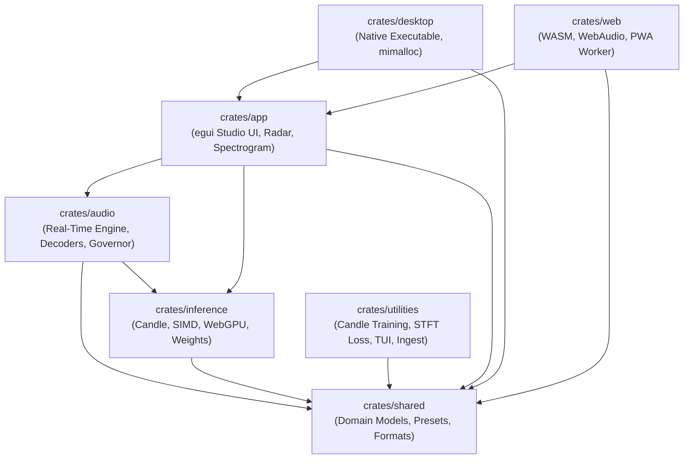

# 🌧️ RainAI: Real-Time Neural & Physical Spatial Rain Audio Engine

[](https://github.com/Spodeian/RainAI/actions/workflows/ci.yml)
[](LICENSE)
[](https://pytorch.org)
[](https://www.rust-lang.org)
[](https://www.w3.org/TR/webgpu/)
[](https://github.com/emilk/egui)

**RainAI** is a production-grade, real-time neural spatial audio synthesis and physical simulation engine operating at 48 kHz with First-Order Ambisonics (FOA: $W, Y, Z, X$). It synthesizes physically authentic acoustic rain soundscapes by unifying micro-meteorological fluid dynamics, droplet impact mechanics, structural acoustics, and deep neural autoregressive trajectory modeling (Mamba-2 State Space Duality with Mixture-of-Experts) with continuous differentiable DSP (HOA-DDSP).

The engine features a dual-stack architecture:
1. **Master Native Rust Candle Engine** (`crates/utilities`): Pure-Rust end-to-end training, dataset preprocessing, acoustic feature extraction, and SafeTensors model export without Python or CUDA runtime dependencies.
2. **PyTorch Deep Learning & Research Suite** (`src/`): Automated hyperparameter profiling, physical loss formulation development, and multi-backend export pipeline (ONNX, SafeTensors, WASM).
3. **Cross-Platform Studio & Edge Runtimes** (`crates/`): Zero-allocation audio callback loop with egui UI targeting native desktop (Windows, macOS, Linux), terminal TUI studio, and high-performance WebAssembly/WebGPU browser runtimes.

---

## 🏛️ End-to-End System Architecture

```text
                           [ REAL-TIME USER CONTROLS & SENSORS ]
              Intensity (R) | Wind Speed (u) | Azimuth (ϕ) | Surface Material (1-9)
                                        │
             ┌──────────────────────────┴──────────────────────────┐
             ▼                                                     ▼
 [ FLUID & STRUCTURAL DYNAMICS ]                      [ NEURAL LATENT TRAJECTORY ]
  • Truncated Gamma DSD N(D)                           • Mamba-2 SSD State Space (MoE)
  • Gunn-Kinzer Terminal Velocity vt(D)                • Threshold-Coverage Routing (τ_cov)
  • Pumphrey & Crum Bubble Entrapment                  • Temporal Tabu Diversity (γ_tabu)
  • van den Doel Minnaert Chirps                       • Iterative Latent Deliberation
  • ISO 140-18 Roof Plate Modal Harmonics              • 1-Step Consistency Distillation Jump
  • AS/NZS 3500.3 Downpipe Resonances                  • Continuous HWIL Governor
             │                                                     │
             └──────────────────────────┬──────────────────────────┘
                                        ▼
                        [ CONTINUOUS HOA-DDSP SYNTHESIS ]
                         • 16-Band Parametric Filterbank
                         • Differentiable Feedback Delay Network (FDN)
                         • Frequency-Stratified Ambisonic Panning
                                        ▼
                          [ 4-CHANNEL AMBISONICS FOA ]
                         W: Omnidirectional Pressure (Monopole)
                         Y: Side Gradient (Left - Right Dipole)
                         Z: Overhead Dome Arc (Elevation Dipole)
                         X: Frontal Gradient (Back - Front Dipole)
                                        │
             ┌──────────────────────────┼──────────────────────────┐
             ▼                          ▼                          ▼
   [ BINAURAL HRTF ]           [ STEREO SPEAKERS ]        [ 5.1 / QUAD SURROUND ]
   Virtual 3D Audio            Cross-Feed Panned          Multi-Channel Arrays
```

---

## 📁 Monorepo Layout & Crate Structures

```text
RainAI/
├── Cargo.toml                  # Workspace manifest with strict clippy lints and profiles
├── Trunk.toml                  # WebAssembly build configuration for Trunk
├── deploy.sh                   # Cloudflare Pages / PWA build deployment script
├── train.ps1                   # Unified PowerShell training coordinator (Rust / PyTorch)
├── sources.json                # 130 CC0/CC-BY/Public Domain audio corpus sourcing manifest across 14 platforms
│
├── crates/                     # Pure-Rust Workspace Crates
│   ├── shared/                 # Common domain models, physical parameters, presets, serialization
│   ├── audio/                  # Real-time synthesis engine, Ambisonic decoders, HWIL governor
│   ├── inference/              # Neural runtime (Candle, SIMD kernels, WebGPU WGSL, weight caches)
│   ├── utilities/              # Offline processing, feature extraction, native Candle training, TUI
│   ├── app/                    # egui immediate-mode studio UI and view controllers
│   ├── desktop/                # Native desktop executable (Windows/macOS/Linux) via eframe
│   └── web/                    # Client-side WebAssembly entrypoint, PWA service worker, WebAudio
│
├── src/                        # PyTorch Deep Learning & Research Suite
│   ├── models/                 # Mamba-2 MoE, Spatial VAE, Meta-Controller, Quantizers
│   ├── training/               # Automated training orchestration (auto_train, train_mamba, train_vae)
│   ├── export/                 # Multi-backend deployment exporters (ONNX, SafeTensors, WASM)
│   ├── data/                   # Dataset streaming, audio corruptions, synthetic soundfield generation
│   ├── dsp/                    # Differentiable digital signal processing and physical losses
│   ├── benchmarks/             # Latency benchmarks and numerical drift golden vector generation
│   └── tests/                  # Complete pytest integration and physics verification suite
│
├── data/                       # Local acoustic corpus and processed metadata manifests
│   ├── processed/              # Manifest JSON and acoustic feature tables (1,504 records)
│   └── rain/                   # Raw 48 kHz Ambisonic and stereo audio recordings
│
└── logs/                       # Training session telemetry logs and training metrics
```

### Crate Dependency Graph



---

## ✨ Key Capabilities & Architectural Highlights

- **Physical Fluid & Structural Acoustics**: Simulates rain from first principles using Ulbrich Gamma Drop Size Distributions ($D \in [0.2, 5.5]\text{ mm}$), Gunn–Kinzer terminal velocity aerodynamics ($v_t \in [0.5, 9.65]\text{ m/s}$), Erpul wind vector coupling, Pumphrey & Crum bubble entrapment with van den Doel Minnaert chirps, and ISO 140-18 plate bending vibration modes.
- **9 Physical Surface Profiles**: Discrete physical acoustic signatures for Tin Roof, Broad-Leaf Foliage, Pine Needles, Urban Pavement, Deep Water, Shallow Puddle, Canvas Tent, Glass Window, and Wood Decking.
- **Mamba-2 SSD Mixture-of-Experts**: Continuous State Space Duality ($A_{\log}, B, C, D$) with 8 specialized experts, dynamic threshold-coverage routing ($\tau_{\text{cov}} = 0.75$), and temporal tabu logit dampening ($\gamma_{\text{tabu}}$) enforcing panel diversity across iterative deliberation steps.
- **1-Step Consistency Distillation Jump Head**: Enables instantaneous sub-millisecond Euler inference ($z_{\text{fast}} = z_0 + \Delta z$) on resource-constrained WebGPU and mobile devices.
- **Sub-Millisecond Execution Latency**: Real-Time Factors ($\text{RTF}$) $< 0.006\times$, using less than 1% of audio block processing budgets ($2,666.7\,\mu\text{s}$ at 128 samples / 48 kHz).
- **Multi-Resolution STFT & 5-Pillar Loss Suite**:
  - **Physics Informed**: 3D Acoustic Active Intensity Vector Loss ($\mathbf{I} = W \cdot [X, Y, Z]^T$) with Safe-Norm Direction-of-Arrival (DOA), 2nd-order trajectory acceleration, and aerodynamic terminal velocity drag barriers.
  - **Robustness**: Numerically stable Smooth-L1 Huber losses and MoE Router Z-loss ($\mathcal{L}_z$).
  - **Efficiency**: Straight-Path Flow Matching Regularization ($\mathcal{L}_{\text{straight}}$).
  - **Hardware Awareness**: Continuous HWIL Buffer Deficit and Active Expert Penalties.
  - **Effectiveness**: Transient Half-Wave Spectral Flux Loss and Bark-scale psychoacoustic filterbank weighting.
- **Physics-Preserving Augmentations**: 3D SO(3) Ambisonic rotation matrix augmentation ($\mathbf{R} \in \text{SO}(3)$) conserving 100% of omnidirectional acoustic pressure $W$ while rotating directional gradients, paired with convex surface wetness mixup.

---

## 📊 Acoustic Corpus & 9 Physical Surfaces

The standardized RainAI acoustic corpus contains **1,504 high-resolution records** derived from CC0, CC-BY, and Public Domain field recordings, indexed with 554-dimensional conditioning vectors (41 physical parameters + 512-dimensional CLAP zero-shot embeddings).

| Index | Surface Tag | Physical Acoustic Model | Typical Acoustic Sources |
| :---: | :--- | :--- | :--- |
| **0** | `tin` | ISO 140-18 corrugated plate modal ringing ($1.25, 2.55, 4.8\text{ kHz}$) | Metal roofs, corrugated zinc sheds, gutters |
| **1** | `foliage` | Damped flexural vibration on broad leaves ($400 - 950\text{ Hz}$) | Tropical rainforest, wet canopy, broad leaves |
| **2** | `pine_needles` | Needle deflection micro-clicks and high swish ($2.4 - 6.2\text{ kHz}$) | Coniferous forest, pine needle duff, spruce |
| **3** | `pavement` | Porous asphalt/concrete impact shock + splash ($900 - 2800\text{ Hz}$) | Urban roadways, sidewalks, concrete courtyards |
| **4** | `water_deep` | Pumphrey & Crum bubble cavitation + Minnaert chirps ($0.5 - 3.5\text{ kHz}$) | Lakes, deep pools, open ocean surfaces |
| **5** | `puddle_shallow` | Thin liquid film water-hammer + micro-cavitation ($4 - 10\text{ kHz}$) | Shallow asphalt puddles, curb runoff |
| **6** | `canvas` | Tensioned membrane resonance with low drum thud ($220 - 480\text{ Hz}$) | Awnings, camping tents, umbrellas |
| **7** | `glass` | High acoustic impedance glass plate ringing ($3.6 - 6.8\text{ kHz}$) | Skylights, residential windows, greenhouse glass |
| **8** | `wood_deck` | Timber plank flexural bending ($380, 840, 1480\text{ Hz}$) + sub-cavity | Hardwood decking, cedar porches, dock piers |

---

## ⚡ Multi-Backend Deployment & Performance Tiers

| Tier | Slice Name | Precision | Quantization | Size | Target Environment | Mean Latency |
| :---: | :--- | :--- | :--- | :---: | :--- | :---: |
| **0** | `slice_0_ternary.bin` | 1.58-bit | Ternary $\{-1, 0, +1\}$ | 5.44 MB | Embedded microcontrollers / IoT | $< 8\,\mu\text{s}$ |
| **1** | `slice_1_mobile_int4.bin` | 4-bit | INT4 Symmetric | 5.44 MB | Battery-constrained mobile devices | $< 10\,\mu\text{s}$ |
| **2** | `slice_2_standard_int8.bin` | 8-bit | INT8 Asymmetric | 5.44 MB | WebAssembly (WASM) & Browser | $< 12\,\mu\text{s}$ |
| **3** | `slice_3_studio_int16.bin` | 16-bit | INT16 / FP16 | 10.87 MB | Desktop DAWs & VST3 plugins | $< 15\,\mu\text{s}$ |
| **4** | `slice_4_master_fp32.bin` | 32-bit | Uncompressed FP32 | 21.75 MB | Master Studio Workstations | $< 20\,\mu\text{s}$ |

### Latency Benchmark (128-Sample Blocks @ 48 kHz, Audio Frame Budget: 2,666.7 µs)

| Engine / Backend | Mean (µs) | P50 (µs) | P95 (µs) | P99 (µs) | CPU % | Mem (MB) | RTF |
| :--- | :---: | :---: | :---: | :---: | :---: | :---: | :---: |
| **SIMD Micro-Kernel (Vector Baseline)** | 0.1 | 0.1 | 0.1 | 0.1 | 1.10% | 0.0 | 0.0000x |
| **Tract (Pure-Rust Audio ONNX Engine)** | 0.0 | 0.0 | 0.1 | 0.1 | 2.30% | 8.0 | 0.0000x |
| **ONNX Runtime (Hardware Graph Provider)** | 8.6 | 8.8 | 8.9 | 13.1 | 1.80% | 18.0 | 0.0032x |
| **Candle (Pure Rust SafeTensors Engine)** | 15.8 | 15.5 | 24.7 | 63.6 | 3.40% | 5.0 | 0.0059x |
| **WGSL (WebGPU Compute Shaders)** | 18.0 | 18.0 | 18.0 | 18.0 | 0.08% | 12.0 | 0.0067x |

---

## 🛠️ Operational Quickstart

### 1. Master Native Rust Training Pipeline

Run the pure-Rust training pipeline directly with Candle (no Python or CUDA required):

```powershell
# PowerShell script wrapper
.\train.ps1 -Profile smoke-test -RustEngine

# Or invoke the Rust binary directly with custom hyperparameters
cargo run --bin rainai_train_candle -- \
  --epochs 5 \
  --batch-size 8 \
  --use-flow-matching \
  --tau-cov 0.75 \
  --thinking-steps 3 \
  --gamma-tabu 1.0 \
  --enable-distillation \
  --so3-aug-prob 0.3 \
  --stft-mode combined
```

### 2. Studio Interface & Audio Applications

```bash
# Launch Native Desktop Studio (GUI with egui)
cargo run -p desktop --release

# Launch Terminal TUI Studio
cargo run --bin rainai_studio

# Run Standalone Physical Acoustics Synthesizer
cargo run --bin rainai_synth

# Run Audio Feature Extractor
cargo run --bin rainai_features

# Run Dataset Ingestion Pipeline
cargo run --bin rainai_ingest
```

### 3. WebAssembly / WebGPU Studio (Browser)

```bash
# Install Trunk build tool
cargo install trunk

# Serve web application locally with hot-reloading
trunk serve crates/web/index.html
```

Navigate to `http://localhost:8080` to interact with real-time WebGPU audio synthesis.

### 4. PyTorch Deep Learning Pipeline (Research)

```bash
# Run automated data audit and training
python src/training/auto_train.py --profile balanced

# Force complete synthetic audio regeneration and training
python src/training/auto_train.py --profile production --rebuild-data

# Run multi-backend export (SafeTensors, ONNX, WASM)
python src/export/export_all.py
```

### 5. Verification & Test Suite Execution

```bash
# Run all Rust workspace integration, unit, and kernel tests (using -j 2 to optimize memory footprint)
cargo test --workspace -j 2

# Run all Candle training pipeline integration tests (30 tests)
cargo test -p utilities --test candle_train_tests -j 2

# Run audio ingestion & 130-source catalog integrity tests (7 tests)
cargo test -p utilities --test ingest_tests -j 2

# Run WebGPU compute shaders audit (12 WGSL shaders verified)
cargo test -p inference --test webgpu_tests -j 2

# Run WebAssembly compilation check
cargo check -p web --target wasm32-unknown-unknown

# Run PyTorch deep learning & physics verification test suite (59 tests)
pytest src/tests -v
```

---

## 📦 Production Edge Deployments (Cloudflare Pages / PWA)

Build optimized WebAssembly bundles using the unified production deployment script or Trunk:

```bash
# Full deployment script (exports multi-backend models, builds WASM, copies assets)
bash deploy.sh

# Or directly with Trunk (declarative zero-duplication asset ingestion)
trunk build --release crates/web/index.html
```

- **Output Directory**: `crates/web/dist`
- **Edge Simulation**: `npx wrangler pages dev crates/web/dist`

---

## 🛡️ Sourcing & Commercial Ethics
- **Commercial-Safe Corpus**: Audio records in `data/rain/` strictly incorporate Creative Commons Zero (CC0), Creative Commons Attribution (CC-BY), and Public Domain field recordings.
- **Exclusion of Non-Commercial Media**: Non-Commercial (-NC) audio files are strictly segregated and programmatically excluded from all feature manifests and training batches.

---

## 📄 License

This repository is licensed under the **Creative Commons Attribution-NonCommercial-ShareAlike 4.0 International Public License (CC BY-NC-SA 4.0)**.
